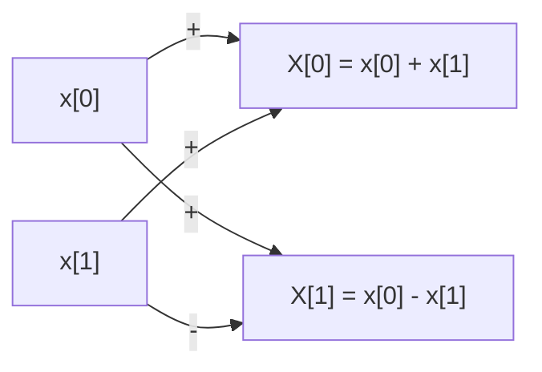

> # Week 1
>
> We talked about prime numbers, divisibility. Then we talked about groups, rings, and fields. We also talked about Montgomery form for field elements, and using limbs for that for better performance. In particular, we talked about Mersenne primes and MiniGoldilocks prime, and show how we can have efficient "modular reductions" there. We had an extra lecture on FFTs.

# Arithmetic

## Primes

Prime numbers are defined as positive integers greater than 1 that have no positive divisors other than 1 and themselves. In other words, a prime number is a number that cannot be formed by multiplying two smaller positive integers. Number 1 is not a prime, although sometimes it may be useful to consider it as a prime; not in our case anyways.

The [fundamental theorem of arithmetic](<(https://en.wikipedia.org/wiki/Fundamental_theorem_of_arithmetic)>), also called the unique factorization theorem and prime factorization theorem, states that every integer greater than 1 can be represented uniquely as a product of prime numbers, up to the order of the factors.

$$
n = p_1^{a_1} \cdot p_2^{a_2} \cdot \ldots \cdot p_k^{a_k}
$$

## Division & GCD

If a number $a$ divides another number $b$, then $a$ is called a divisor of $b$, and $b$ is called a multiple of $a$. The division of two integers $a$ and $b$ can be expressed as $a = b \cdot q + r$, where $q$ is the quotient and $r$ is the remainder. The remainder $r$ is always less than the divisor $b$.

The **greatest common divisor (GCD)** of two integers $a$ and $b$, denoted as $\text{gcd}(a, b)$, is the largest positive integer that divides both $a$ and $b$ without leaving a remainder. The GCD can be computed using the **Euclidean algorithm**, which is an efficient way to find the GCD of two numbers. The algorithm works by iteratively replacing the larger number with the remainder of the division of the two numbers until the remainder is zero. The last non-zero remainder is the GCD of the two numbers.

# Abstract Algebra

## Groups

A group is a set equipped with a binary operation that combines any two elements to form a third element, satisfying certain properties. A group is shown as $(G, \cdot)$ and consists of the following components:

- A set of elements $G$.
- A binary operation (denoted as $\cdot$) that takes two elements and produces a third element.

The operation must satisfy the following properties:

- **Closure**: For any two elements $a, b \in G$, the result of the operation is also in the group: $a \cdot b \in G$. It is said that the group $G$ is _closed_ under its binary operation.

- **Identity**: There exists an element $e \in G$, called the identity element, such that for any element $a \in G$, the operation $a \cdot e = e \cdot a = a$.

- **Inverse**: For every element $a \in G$, there exists an element $b \in G$, called the inverse of a, such that $a \cdot b = b \cdot a = e$. The inverse of $a$ is denoted as $a^{-1}$.

- **Associativity**: For any three elements $a, b, c \in G$, the operation is associative, meaning $(a \cdot b) \cdot c = a \cdot (b \cdot c)$. This property ensures that the order of operations does not matter.

There is an additional property as well, called the **commutative property** or **abelian property**. A group is said to be _Abelian_ if the binary operation is commutative, meaning $a \cdot b = b \cdot a$ for all elements $a, b \in G$.

If the group has a finite number of elements, it is called a **finite group**.

### Operation Notation

For the binary operation, we can use the additive notation or multiplicative notation.

- **Additive**: $a \cdot b = a + b$
- **Multiplicative**: $a \cdot b = ab$

### Examples

- The integers under addition $(\mathbb{Z}, +)$.
- The integers modulo $n$ under addition $(\mathbb{Z}_n, +)$.

## Rings

A ring is a set equipped with two binary operations, addition and multiplication, that satisfy certain axioms. A ring $(R, +, \times)$ consists of the following components:

- A set of elements $R$.
- An addition operation (denoted as $+$) that takes two elements and produces a third element.
- A multiplication operation (denoted as $\times$) that takes two elements and produces a third element.

The operations must satisfy the following properties:

- **Additive + Multiplicative Closure**: For any two elements $a, b \in R$, the result of the addition is also in the ring: $a + b \in R$ and the result of the multiplication is also in the ring: $a \times b \in R$. The ring $R$ is _closed_ under both addition and multiplication.

- **Additive + Multiplicative Associativity**: For any three elements $a, b, c \in R$, the addition and multiplication operations are associative, meaning $(a + b) + c = a + (b + c)$ and $(a \times b) \times c = a \times (b \times c)$. This property ensures that the order of operations does not matter.

- **Additive Identity**: There exists an element $0 \in R$, called the additive identity, such that for any element $a \in R$, the addition $a + 0 = 0 + a = a$. Nothing is said about multiplication yet.

- **Additive Inverse**: For every element $a \in R$, there exists an element $-a \in R$, called the additive inverse of $a$, such that $a + (-a) = (-a) + a = 0$. The inverse of $a$ is denoted as $-a$.

- **Addition Commutativity**: The addition operation is commutative, meaning $a + b = b + a$ for all elements $a, b \in R$.

- **Distributivity**: For any three elements $a, b, c \in R$, the ring satisfies the distributive property, meaning $a \times (b + c) = (a \times b) + (a \times c)$ and $(b + c) \times a = (b \times a) + (c \times a)$.

If the ring has a **multiplicative identity**, i.e., an element $e \in R$ such that $a \times e = e \times a = a$ for all $a \in R$, then the ring is called a _ring with unity_ and that element $e$ is called a **unity**.

If the multiplication is **commutative**, then the ring is called a **commutative ring**.

If the ring has a finite number of elements, it is called a **finite ring**.

### Examples

- The set $\mathbb{Z}$ of all integers, and is a commutative ring with unity.
- The set $\mathbb{Q}$ of all rational numbers.
- The set $\mathbb{R}$ of all real numbers.
- The set $\mathbb{C}$ of all complex numbers.

## Fields

A field is a ring $(F, +, \times)$ with the following properties:

- $F$ is a commutative ring.
- There is a non-zero unity $e \in F$.
- Every non-zero element $a \in F$ have a multiplicative inverse $a^{-1} \in F$ such that $a \times a^{-1} = a^{-1} \times a = e$.

If the field has a finite number of elements, it is called a **finite field**. The ring of integers modulo $p$, denoted as $\mathbb{Z}_p$, where $p$ is a prime number, is a finite field. This one is particularly important in cryptography!

> We can also say that a field is an "integral domain" where every non-zero element has a multiplicative inverse.

### Implementation

Doing division & modulo in a finite field is expensive, so we want to avoid it as much as possible. One way to do this is to use the **Montgomery form** for field elements. This form allows us to perform modular reductions more efficiently. See [Montgomery Arithmetic](https://eprint.iacr.org/2017/1057.pdf) for more details. Lambdaworks has a struct called `MontgomeryBackendPrimeField` for this, see <https://github.com/lambdaclass/lambdaworks/blob/main/math/src/field/fields/montgomery_backed_prime_fields.rs>.

# Polynomials

A polynomial is an expression consisting of variables (also called indeterminates) and coefficients, that involves only the operations of addition, subtraction, multiplication, and non-negative integer exponents. The general form of a polynomial is:

$$
f(x) = a_n x^n + a_{n-1} x^{n-1} + \ldots + a_1 x + a_0
$$

where $a_n, a_{n-1}, \ldots, a_1, a_0$ are the coefficients, $x$ is the variable, and $n$ is the degree of the polynomial. Polynomials are usually defined over rings, and the coefficients are elements of the ring. We are in particular interested in polynomials over finite fields of prime order.

### Implementation

The most basic implementation of polynomials is by storing the list of coefficients, see for example <https://github.com/lambdaclass/lambdaworks/blob/bootcamp0b10/math/src/polynomial/mod.rs>.

To evaluate the polynomial at a point, we can use the **Horner's method**, which is an efficient way to evaluate polynomials. The method is based on the observation that a polynomial can be rewritten as a nested form:

$$
f(x) = a_n x^n + a_{n-1} x^{n-1} + \ldots + a_1 x + a_0 = ((a_n x + a_{n-1}) x + \ldots + a_1) x + a_0
$$

## Evaluations

A degree $n$ polynomial can be represented by $n+1$ points. The polynomial interpolation problem is to find a polynomial of degree at most $n$ that passes through $n+1$ given points. **Lagrange interpolation** formula is a widely used method to find the polynomial that passes through the given points. In fact, there is a unique degree $n$ polynomial that passes through $n+1$ distinct points. This polynomial can be found using the Lagrange interpolation formula, which is based on the Lagrange basis polynomials.

## Shamir's Secret Sharing

Shamir's Secret Sharing is a cryptographic algorithm that allows a secret to be shared among a group of participants, such that only a subset of the participants can reconstruct the secret. The algorithm is based on polynomial interpolation, noting the fact that a degree $n-1$ polynomial can be uniquely determined by $n$ points.

The algorithm works as follows:

1. The secret is represented as a constant term of a polynomial of degree $t-1$.
2. A random polynomial of degree $t-1$ is generated, where the constant term is the secret.
3. The polynomial is evaluated at $n$ distinct points such that $n > t$, and the evaluations are shared among the participants.
4. To reconstruct the secret, at least $t$ participants combine their shares and interpolate the polynomial to find the secret.

The security of Shamir's Secret Sharing is based on the fact that any subset of less than $t$ participants does not have enough information to reconstruct the polynomial and hence the secret. Note that this security is not a computational security, but rather an information-theoretic security; meaning that there is absolutely no way to recover the secret without the required number of shares.

LambdaWorks has a struct called `ShamirSecretSharing` for this, see <https://github.com/lambdaclass/lambdaworks/tree/main/examples/shamir_secret_sharing>.

## Reed-Solomon Codes

Reed-Solomon codes are a type of error-correcting code that is widely used in digital communication and storage systems. Consider a message $m=(m_1, m_2, \ldots, m_k)$ of length $k$ that needs to be transmitted over a noisy channel. Reed-Solomon codes encode the message into a longer codeword $c=(c_1, c_2, \ldots, c_n)$ of length $n > k$ such that the original message can be recovered even if some of the codeword symbols are corrupted.

The encoding process involves generating a polynomial of degree $k-1$ from the message symbols and evaluating the polynomial at $n$ distinct points to obtain the codeword symbols. The decoding process involves interpolating the polynomial from the received codeword symbols to recover the original message.

> One can think of Reed-Solomon as a Shamir's Secret Sharing scheme where the secret is the message to be transmitted, and the shares are the codeword symbols. However, all the shares are sent over the network so that if some of them are lost or corrupted, the original message can still be recovered.

### Distance

The **minimum distance** of a code is the minimum number of positions in which any two codewords differ. It is a measure of the error-correcting capability of the code.

Error correcting codes have a measure of **distance** that is usually computed as the Hamming distance, which is the number of positions at which the corresponding symbols of two codewords are different. For instance:

```py
#   ✓  x  x  ✓  ✓  ✓
m1: A  B  C  D  E  F
m2: A  A  D  D  E  F
```

These two messages have a Hamming distance of 2, because the second and third symbols are different. Reed-Solomon codes have a minimum distance of $n-k+1$, which means they can correct up to $(n-k)/2$ errors. The idea is that if the errors are less than or equal to $(n-k)/2$, then the decoder can correct them by finding the closest codeword to the received word.

# RSA Cryptosystem

RSA (Rivest-Shamir-Adleman) is a public-key cryptosystem that is widely used for secure data transmission. It is based on the difficulty of factoring large integers. The RSA algorithm involves the following steps:

- Choose two large prime numbers $p$ and $q$, and then compute $n = p \times q$.

- Compute the **Euler totient function** $\phi(n) = (p-1) \times (q-1)$. The Euler totient function $\phi(n)$ counts the number of positive integers less than $n$ that are coprime to $n$. It has a nice property that when $n$ is a prime number, $\phi(n) = n-1$. Furthermore, it is a [multiplicative function](https://crypto.stanford.edu/pbc/notes/numbertheory/mult.html), meaning that $\phi(ab) = \phi(a) \times \phi(b)$ if $a$ and $b$ are coprime. Thats how we get $(p-1)\times(q-1)$ quite easily.

> When the requirement of $GCD(a, b) = 1$ is not strict for the multiplicative function, we call it a **totally multiplicative** function.

> One can also use the **Carmichael totient function** $\lambda(n)$, which is the smallest positive integer such that $a^{\lambda(n)} \equiv 1 \mod n$ for all $a$ coprime to $n$. The Carmichael function is always less than or equal to the Euler totient function, and is often used in RSA for more efficient implementations.

- Choose an integer $e$ such that $1 < e < \phi(n)$ and $e$ is coprime to $\phi(n)$. The number $e$ is the public exponent, usually a **Fermat Prime** that are primes of the form $2^k+1$. Some choices for $e$ are $3, 17$ and $65537$. Note that these are equal to $2^1+1, 2^4+1$ and $2^{16}+1$ respectively.

> Choosing a small $e$ makes encryption faster, but is also susceptible to attacks. Most often we choose $e=65537$. For example, when $e=3$ it may be the case that $m^3$ is not so large, and is still within the modulus, so one can simply find the cube-root of the ciphertext to recover the plaintext.

- Compute the private exponent $d$ such that $d \equiv e^{-1} \mod \phi(n)$. The number $d$ is the private exponent.

- The **public key** is $(n, e)$, and the **private key** is $(p, q, d)$. If either $p$ or $q$ is known, the rest can be computed.

To encrypt a message $m \in \mathbb{Z}_n$, the sender uses the public key $(n, e)$ to compute the ciphertext $c = m^e \mod n$. To decrypt the ciphertext, the receiver uses the private key $d$ to compute the plaintext $m = c^d \mod n$. This works because $m^{e \times d} \equiv m \mod n$ by Euler's Theorem.

> **Euler's Theorem** states that for co-prime integers $a$ and $n$, $a^{\phi(n)} \equiv 1 \mod n$.
>
> If $n = p$ is a prime number, then $\phi(p) = p-1$, and so $a^{p-1} \equiv 1 \mod p$ for all $a$ coprime to $p$, this is **Fermat's Little Theorem**. Euler's theorem generalizes this to composite numbers.

The security of RSA is based on the difficulty of factoring the product $n = p \times q$.

## Generating Primes

When the prime is not large, one can simply check if it is prime by trial division. However, when the prime is large, this method is not efficient. One way to generate large prime numbers is to use the **Miller-Rabin primality test**, which is a probabilistic algorithm that can determine whether a number is prime with high probability. The algorithm works by repeatedly testing the primality of a number using a set of random bases.

> Note that if primes are chosen to be close to eachother, you can be attacked due to Fermat's Factorization, see more at <https://fermatattack.secvuln.info/>.

## Implementation

See <https://blog.lambdaclass.com/how-to-create-your-own-crappy-rsa-as-a-software-developer/>.

# Fast Fourier Transform (FFT)

> These notes are taken from an extra lecture. See also [this](https://www.phys.uconn.edu/~rozman/Courses/m3511_19s/downloads/radix2fft.pdf).

The idea of Discrete (or Finite) Fourier Transform (DFT) is that we have a vector $x = (x_0, x_1, \ldots, x_{N-1}) = \{x_n\}$ with $N$ elements, and we want to obtain another vector $X = (X_0, X_1, \ldots, X_{N-1}) = \{X_k\}$ with $N$ such that:

$$
X_K = \sum_{n = 0}^{N-1}x_n e^{-\frac{2\pi i}kn} = \sum_{n = 0}^{N-1}x_n \omega^{kn}
$$

The terms $e^{-\frac{2\pi i}{N}kn}$ are the **roots of unity**, and they are usually shown with $\omega$ such that for $i=\sqrt{-1}, k = 0, 1, \ldots, N-1$:

$$
\omega = e^{-\frac{2\pi i}{N}}
$$

## Primitive Root of Unity

This $\omega$ is a primitive $N$-th root of unity. A primitive $n$-th root of unity is a root of unity whose multiplicative order is $n$. More formally, $\omega$ is a primitive $n$-th root of unity if $\omega^n = 1$ and $\omega^k \neq 1$ for all $k < n$, meaning that $n$ is the smallest number satisfying $\omega^n = 1$.

In the domain of complex numbers, the roots of unity are the solutions to the equation $z^n = 1$. The solutions are given by $z_k = e^{\frac{2\pi i}{n}k}$ for $k \in \{0, 1, \ldots, n-1\}$. These roots form a cyclic group of order $n$ under multiplication, and they are equally spaced around the unit circle in the complex plane.

> Remember Euler's law that states $e^{ix} = \cos{x} + i\sin{x}$. Of course, when $x = 2\pi/n$, we have $e^{i\frac{2\pi i}{n}}$, and taking that to $n$'th power gives us $e^{2\pi} = \cos{2\pi} + i\sin{2\pi} = 1 $.

There are some properties that are important for the primitive roots:

- **Periodicity**: $\omega^{n+k} = \omega^k$ for all $k \in \mathbb{Z}$. This is evident as $\omega^n = 1$ acts like the identity of multiplication.

- **Symmetry**: $\omega^{k + n/2} = -\omega^{k}$ for all $k \in \mathbb{Z}$. This is because $\omega^n = 1$.

Also note that if $\omega$ is an $n$-th root of unity, then $\omega^2$ is a $(n/2)$'th root of unity.

## Cooley-Tukey Radix-2 FFT

Fix $N$ to be some power of two as $N = 2^m$. The trick is that we can decompose a FFT over $N$ as two FFTs over $N/2$, reducing the problem size in half. In fact, we can do this recursively to obtain a very efficient algorithm, reducing the complexity from $\mathcal{O}(N^2)$ to $\mathcal{O}(N \log{N})$.

The trick is the following arrangement of the equation for $X_K$ defined above:

$$
X_k =

\sum_{m=0}^{N/2-1}x_{2m} e^{-\frac{2\pi i}{N}(2m)k}
+
\sum_{m=0}^{N/2-1}x_{2m+1} e^{-\frac{2\pi i}{N}(2m+1)k}
$$

In other words, we have split the sum in two: one for the _even_ indices and one for the _odd_ indices. This is the key to the FFT algorithm! Now, we can actually factor out $e^{-\frac{2\pi i}{N}}$ from the second term, and obtain the following:

$$
X_k =

\sum_{m=0}^{N/2-1}x_{2m} e^{-\frac{2\pi i}{N}(2m)k}
+
e^{-\frac{2\pi i}{N}k} \sum_{m=0}^{N/2-1}x_{2m+1} e^{-\frac{2\pi i}{N}(2m)k}
$$

Let us denote the first sum as $E_k$ and the second sum as $O_k$. Then we have:

$$
X_k = E_k + e^{-\frac{2\pi i}{N}k} O_k
$$

The functions $E_k$ and $O_k$ are periodic with period $N/2$, meaning that $E_{k+N/2} = E_k$ and $O_{k+N/2} = O_k$. This is because the roots of unity are periodic with period $N$. Thanks to this fact, we have the following for $X_k$:

$$
X_k =
\begin{cases}
E_k       + e^{-\frac{2\pi i}{N}k} O_k       & \text{for } 0   \leq k < N/2 \\
E_{k-N/2} - e^{-\frac{2\pi i}{N}k} O_{k-N/2} & \text{for } N/2 \leq k < N
\end{cases}
$$

The factor $e^{-\frac{2\pi i}{N}k}$ is called the **Twiddle factor**, and it also has the following cool property:

$$
e^{-\frac{2\pi i}{N}(k+N/2)} = e^{-\frac{2\pi i}{N}k} e^{-\pi i} = -e^{-\frac{2\pi i}{N}k}
$$

Therefore, we can write $X_k$ as the following:

$$
\begin{align*}
X_k &= E_k + e^{-\frac{2\pi i}{N}k} O_k \\
X_{k+N/2} &= E_k - e^{-\frac{2\pi i}{N}k} O_k \\
\end{align*}
$$

This final result is how we express a DFT of length $N$ as two DFTs of length $N/2$. This two-line operation is also called a "Butterfly", and for $N=2$ we can show it as follows:

$$
\begin{align*}
X_0 &= x_0 + x_1 \\
X_1 &= x_0 - x_1 \\
\end{align*}
$$

Here it is in Mermaid as well:



## Number Theoretic Transform

> See [this term project](https://open.metu.edu.tr/bitstream/handle/11511/102002/Asl%C4%B1_Ebru_Kaya_Term_Project.pdf) for more details on radix-2 NTT, or [this lovely post](https://decentralizedthoughts.github.io/2023-09-01-FFT/).

In finite fields, we replace $e^{\frac{-2\pi i}{N}K}$ that generates a subgroup of size $N = 2^m$, with some values $g$ in a **finite field** that generates a subgroup of size $N = 2^m$. For this reason, we need to choose a field such that $p-1 = 2^m \times k$ for some irrelevant constant $k$. When the prime order of the field is like this, we call them FFT-friendly.

For example, $\mathbb{F}_{17}$ is FFT-friendly since $17-1 = 2^4 \times 1$. You can therefore to FFTs up to $N=16$, if you have a generator that generates a subgroup of size 16.

The algorithm we describe above is the radix-2 FFT, where we do even-odd splits. You can do radix-4 splits as well.

When you have the polynomial, the direct FFT is good for **interpolation**, and inverse FFT is good for **evaluation**. The points where the polynomial is evaluated are the **roots of unity**, that is the trick.

### Example

Consider the Mini Goldilocks group with order $p = 2^{64} - 2^{32} + 1$. Here, $g = 7$ is a generator of the multiplicative group. Now, notice that $p-1=2^{32} \times (2^{32} - 1)$. Fermat's Little Theorem tells us:

$$
g^{p-1} \equiv 1 \mod p
$$

Well,

$$
{g^{{2^{32}} \times 2^{32}-1}} \equiv 1 \mod p
$$

Now, let $g' = g^{2^{32}-1}$. We have:

$$
{g'}^{2^{32}} \equiv 1 \mod p
$$

This tell us that $g'$ is a generator of the subgroup of size $2^{32}$, and we can use it to do FFTs of size $2^{32}$.

### Implementation

LambdaWorks have the implementations at <https://github.com/lambdaclass/lambdaworks/tree/main/math/src/fft>.
