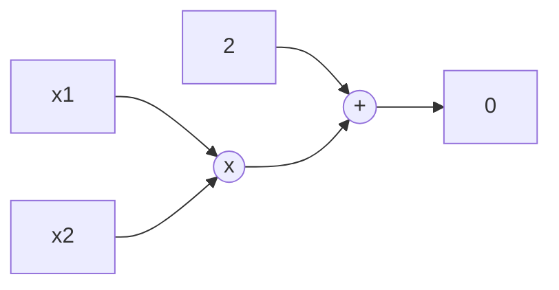

> # Week 3
>
> We talked about SNARKs, BabySNARK (do do doo) in particular.

# SNARKs

A SNARK is a "Succinct Non-interactive Arugment of Knowledge". Note that an "argument" is different than a "proof".

Consider a language $\mathcal{L}$. Given an **instance** (public input) $x \in \mathcal{L}$, a SNARK is an argument of knowledge that a prover knows a **witness** (secret input) $w$ such that $R(x, w) = 1$ where $R$ is a relation.

We usually formalize this relation using an arithmetic circuit $C$ that takes $x$ and $w$ as input and outputs 1 if $R(x, w) = 1$. Here is an example circuit for $x_1 \times x_2 + 2 = 0$:



What we want from a SNARK is that it should have:

- **fast computation**: something like $\mathcal{O}(n \log n)$ or $\mathcal{O}(\sqrt{n})$ (e.g. Binius).
- **low communication**: sending the entire witness $w$ would be the naive way, but we would like to be much efficient than doing that.

## Problems in NP Class

A problem is in the NP class if given a solution, we can verify it in polynomial time. For example, the problem of finding a Hamiltonian cycle in a graph is in NP class.

**NP-complete** problems are such problems that any NP problem can be reduce to an NP-complete problem. Some examples of NP-complete problems are:

- Boolean circuit satisfiability
- Arithmetic circuit satisfiability
- Three-coloring problem

In the context of SNARKS, the idea is the following reduction:

$$
\text{Problem} \to \text{NP-complete Problem} \to \text{SNARK}
$$

# BabySnark

BabySNARK is a minimal implementation that has the SNARK "magic", and is fairly digestible to understand as a beginner. It is originally based on [this](https://eprint.iacr.org/2014/718.pdf) paper, and the repository can be found at [initc3/babySNARK](https://github.com/initc3/babySNARK/).

## Square Span Problems

A square span program is a program that takes a vector $z$ and a matrix $U$. If $z$ is a valid assignment, then:

$$
(U \cdot z) \cdot (U \cdot z) = 1
$$

In short:

$$
(U . z)^2 = 1
$$

We can describe boolean circuits using square span programs! The vector $z$ will have a constant term 1, the instance terms $x_0, x_1, \ldots, x_n$ and the witness terms $w_0, w_1, \ldots, w_m$. So:

$$
z = (1, x_0, x_1, \ldots, x_n, w_0, w_1, \ldots, w_m)
$$

For convenience, we usually write this as $z = (1, x, w)$.

Example: Consider the XOR operation $a \oplus b = c$.

- $a$ must be a bit, so $a(1 - a) = 0$ which we can write as a Square Span: $(2a - 1)^2 = 1$
- $b$ must be a bit, so $b(1 - b) = 0$ which we can write as a Square Span: $(2b - 1)^2 = 1$
- $c$ must be a bit, so $c(1 - c) = 0$ which we can write as a Square Span: $(2c - 1)^2 = 1$
- $c = a + b - 2ab$ corresponds to XOR operation, but this is hard to write as a Square Span. Instead, notice that $a+b+c-1 \in \{-1, 1\}$, so we can actually write the Square Span: $(a+b+c-1)^2 = 1$.

So we have the system of equations:

$$
\begin{align*}
(2a - 1)^2 &= 1 \\
(2b - 1)^2 &= 1 \\
(2c - 1)^2 &= 1 \\
(a + b + c - 1)^2 &= 1
\end{align*}
$$

Now lets write this as a matrix equation:

```math
\begin{pmatrix}
    -1 & 2 & 0 & 0 \\
    -1 & 0 & 2 & 0 \\
    -1 & 0 & 0 & 2 \\
    -1 & 1 & 1 & 1
\end{pmatrix}
\begin{pmatrix}
1 \\ a \\ b \\ c
\end{pmatrix}
=
\begin{pmatrix}
1 \\ 1 \\ 1 \\ 1
\end{pmatrix}
```

Square Span problems are "modular" in the sense that we can "connect" them together to form a larger Square Span problem. For example, continuing from the XOR above, if we wanted to compute another XOR of $c \oplus d = e$, we could just add another row to the matrix:

```math
\begin{pmatrix}
    -1 & 2 & 0 & 0 & 0 & 0 \\
    -1 & 0 & 2 & 0 & 0 & 0 \\
    -1 & 0 & 0 & 2 & 0 & 0 \\
    -1 & 1 & 1 & 1 & 0 & 0 \\
    -1 & 0 & 0 & 2 & 0 & 0 \\
    -1 & 0 & 0 & 0 & 2 & 0 \\
    -1 & 0 & 0 & 0 & 0 & 2 \\
    -1 & 0 & 0 & 1 & 1 & 1
\end{pmatrix}
\begin{pmatrix}
1 \\ a \\ b \\ c \\ d \\ e
\end{pmatrix}
=
\begin{pmatrix}
1 \\ 1 \\ 1 \\ 1 \\ 1 \\ 1
\end{pmatrix}
```

Notice that the first 4 rows are the same as the previous matrix, and the last rows are for the new XOR operation. Further notice that 3rd and 5th rows are the same, making the constraint two times gains us nothing, we could optimize the constraints there if we wanted to.

## Programs to Problems

What we often have is that people write "gadgets", such as boolean gates, field operations and such. Then, these "modular" gadgets can be connected together to form a larger problem. Then, a higher-level tool takes in a program that describes the problem and converts it into a SNARK-friendly format.

- Above, we wrote a problem in **Square Span** format. Square Span is not really efficient, but there are other mentioned formats are quite useful, also known as "SNARK-friendly" formats.
- In **Groth16**, you write the program in **R1CS** (Rank-1 Constraint System) format.
- In **Plonk**, you write the problem in **Plonkish** format.
- In zkVMs, you often write the problem in **AIR** (Algebraic Intermediate Representation) format.

Some tools that convert a problem into a SNARK-friendly format are:

- [Circom](https://iden3.io/circom)
- [Noir](https://noir-lang.org/)
- [Cairo](https://www.cairo-lang.org/)

## Zero-Knowledge Property

So to recap Square Span, we have $(U . z)^2 = 1$ which we can write as a linear system of equations:

$$
(\sum u_{ij} z_j)^2 - 1 = 0
$$

I want to show that I know $w$ such that the equation above holds for $z = (1, x, w)$. There is an important property about SNARKs though, the **Zero-Knowledge Property**: we don't want to reveal anything about the witness $w$.

We can make use of univariate polynomials here. Consider a polynomial $u_j(x)$ such that:

$$
(\sum u_{j}(x) z_j)^2 - 1 = p(x)
$$

We will view the columns as evaluations of the polynomial at different points. Consider the matrix:

$$
U =
\begin{pmatrix}
a_{00} & a_{01} & a_{02} \\
a_{10} & a_{11} & a_{12} \\
a_{20} & a_{21} & a_{22}
\end{pmatrix}
$$

So for example at $j=0$ we have the evaluations $a_{00}, a_{10}, a_{20}$. For our evaluation points, we can pick points $\{g^0, g^1, g^2\}$ generated by a generator $g$. In fact, we can use roots of unity for $g$. This means that $u_j(g^i) = a_{ij}$. Now, our equation becomes:

$$
(\sum u_{j}(g^i) z_j)^2 - 1 = p(x)
$$

The trick about our result polynomial $p(x)$ is that given our evaluation domain $D$:

$$
(U.z)^2 - 1 = 0 \iff p(x) = 0 \forall x \in D
$$

If this is indeed true, then $p(x) = Z(x) . h(x)$ or in other words $p(x)$ is divisible by the vanishing polynomial of domain $D$ that is $Z(x)$. The vanishing polynomial is simply:

$$
Z(x) = (x-x_0)(x-x_1)\ldots(x-x_{k-1}) = \prod_{x_i \in D} (x - x_i)
$$

We have chosen our points carefully, i.e. they are in the subgroup of order $k$ (such as roots of unity) and this has a really nice property:

$$
Z(x) = (x-g_0)(x-g_1)\ldots(x-g_{k-1}) = x^{k} - 1
$$

Also remember that we can use FFT to evaluate polynomials really efficiently, and now not only that but we also compute the vanishing polynomial efficiently as well!

As the last step, a random point $s$ is picked, and the following equality is checked:

$$
p(s) = Z(s) . h(s)
$$

In other words $r(x) = 0$ at some random point $s$ where:

$$
p(x) - Z(x) . h(x) = r(x)
$$

> [!WARNING]
>
> This part may be incomplete.

## Trusted Setup

Within our protocol, we have made several MSMs. For this, we need a trusted setup specific to our circuit, We will have two "keys":

**Verifying Key** is used to verify a proof, it has:

1. $u_0(s)g_1, u_1(s)g_1, \ldots, u_n(s)g_1$ which are $n+1$ points as $P_0, P_1, \ldots, P_n$. Thanks to these points, we can compute $V_u(s) = \sum u_k P_k$ (MSM)
2. $u_0(s)g_2, u_1(s)g_2, \ldots, u_n(s)g_2$ which are $n+1$ points, but using the generator $g_2$ instead.
3. $Z(s) g_2$
4. a constant $e(g_1, g_2)^{-1}$
5. $\beta \gamma g_1$
6. $\gamma g_2$

**Proving Key** is used to generate a proof, it has:

1. $g_1, s g_1, s^2 g_1, \ldots, s^n g_1$ which are $n+1$ points as $Q_0, Q_1, \ldots, Q_n$. Thanks to these points, we can compute $h(s) = \sum s^k g$ (MSM)
2. $u_{n+1}(s)g_1, u_{n+2}(s)g_1, \ldots, u_{n+m}(s)g_1$ which are $m$ points
3. $u_{n+1}(s)g_2, u_{n+1}(s)g_2, \ldots, u_{n+1}(s)g_2$ which are $m$ points, but using the generator $g_2$ instead.
4. $\beta u_{n+1}(s)g_1, \beta u_{n+2}(s)g_1, \ldots, \beta u_{n+m}(s)g_1$ which are $m$ points similar to step 2, but multiplied with a constant $\beta$ as well.

The secret values here are $s, \beta$ and $\gamma$. No one should know these, other than the trusted party who have done these computations.

## Proving Phase

1. Compute the commitment $\boxed{V_w}_1 = V_w(s)g_1$ and $\boxed{V_w}_2 = V_w(s)g_2$ and $\boxed{B_w}_1 = B_w(s)g_1 = \beta V_w(s)g_1$

2. Compute $p(x) / Z(x) = h(x)$. This part can be done efficiently using **FFT**. We could get evaluations of $p$ and $Z$ on some random domain, and divide the evaluations, and then interpolate the result to obtain $h$. This is faster than long-division of polynomials.

3. Commit to the result $\boxed{h}_1 = h(s)g_1$.

4. Output proof $\pi = (\boxed{h}_1, \boxed{V_w}_1, \boxed{V_w}_2, \boxed{B_w}_1)$.

The proof used 4 MSMs, and just outputs 4 curve elements. Not only this is much more efficient than sending the entire witness, but this proof size is constant as well! It does not matter how large your circuit is.

## Verification Phase

1. Parse proof to obtain $\pi \to (\boxed{h}_1, \boxed{V_w}_1, \boxed{V_w}_2, \boxed{B_w}_1)$.

2. Check the pairing $e(\boxed{V_w}_1, g_2) = e(g_1, \boxed{V_w}_2)$ to ensure that prover has used the same input for both commitments.

3. Check $e(\boxed{B_w}_1, \beta g_2) = e(\beta \gamma g_1, \boxed{V_w}_2)$ to ensure that prover did not cheat (thanks to $\beta$)

4. Compute $V_u(s)g_1 = \boxed{V_u}_1$ and $V_u(s)g_2 = \boxed{V_u}_2$ from the public inputs.

5. Check $e(\boxed{V_u}_1 + \boxed{V_w}_1, \boxed{V_u}_2 + \boxed{V_w}_2) e(g_1, g_2)^{-1} = e(\boxed{h}_1, \boxed{Z}_2)$ where $\boxed{Z}_2 = Z(s)g_2$.

If all checks pass, the proof is valid!

## Implementation

BabySNARK is implemented in LambdaWorks! See <https://github.com/lambdaclass/lambdaworks/tree/main/examples/baby-snark>.

# Field Extensions

Recall that we had fields defined over integers modulo some prime $p$, denoted as $\mathbb{F}_p$. The elements of this field obeyed the addition and multiplication laws in mod $p$. We can go beyond that.

## Over Real Numbers & Complex Numbers

Consider a ring of polynomials over real numbers $\mathbb{R}[x] = a_0 + a_1x + a_2x^2 + \ldots + a_nx^n$. Then, consider an irreducible polynomial such as $I(x) = x^2 + 1$. We can define a field extension $\mathbb{R}[x] / I(x)$ where we can have elements such as $a + bx$ where $a, b \in \mathbb{R}$.

What happens in this example is that, whenever the degree of polynomial in $\mathbb{R}[x]$ is greater than or equal to $I(x)$, we divide the polynomials and look at the remainder, just like we do in modular arithmetic. So, every polynomial in $\mathbb{R}[x]$ can be written as $a + bx$ where $a, b \in \mathbb{R}$.

When working with polynomials, we can define addition and multiplication laws as well. For the example above:

- $(a_0 + a_1x) + (b_0 + b_1x) = (a_0 + b_0) + (a_1 + b_1)x$
- $(a_0 + a_1x) + (b_0 + b_1x) = a_0b_0 + (a_0b_1 + a_1b_0) + a_1b_1x^2$

Now, that multiplication above has a term $x^2$ which is **not** in our field extension. We can reduce this term using the irreducible polynomial $I(x)$. We will simply divide the result by $I(x)$ and look at the remainder.

> In this case, $a_0b_0 + (a_0b_1 + a_1b_0) + a_1b_1x^2 \bmod{x^2 + 1}$ results in $(a_0b_0 - a_1b_1) + (a_0b_1 + a_1b_0)x$. This is actually equivalent to the Complex number multiplication! In other words, $x^2$ became $-1$.

An irredicuble polynomial can not be factorized into smaller polynomials, doing that would imply that there is a root, in other words: $I(x) = (x - a)Q(x)$ would mean that $a$ is a root of $I(x)$.

Another interesting fact about field extensions is that we still have the definitions for a multiplicative inverse! That is, for $p(x)$ we can find a polynoimal $q(x)$ such that $p(x)q(x) \equiv 1 \pmod{I(x)}$.

> In this example, we have used $I(x) = x^2 + 1$. We call our field extension a "degree-2 extension", or a "quadratic extension". When $(x, y) \in \mathbb{R}$, we can view the field extension as a "$\mathbb{R}$-vector space of dimension 2".

A question one may ask here, why $x^2 + 1$ but not something like $x^2 + 3$? Well, its because both field extensions would be **isomorphic**, so they are essentially the same thing. Using $x^2 + 1$ is just a convention and is much more efficient.

> There are some more efficient multiplication methods in field extensions, such as [Karatsuba](https://en.wikipedia.org/wiki/Karatsuba_algorithm) and [Toom-Cook](https://en.wikipedia.org/wiki/Toom%E2%80%93Cook_multiplication). The funny thing is, uou can even use FFT if you really want and it has the "best asymptotic complexity" for multiplication; but it requires a 1729 dimensional FFT! This result comes from the [Schönhage-Strassen](https://en.wikipedia.org/wiki/Sch%C3%B6nhage%E2%80%93Strassen_algorithm) algorithm. This is not practical in real life usage, making this algorithm a [_Galactic algorithm_](https://en.wikipedia.org/wiki/Galactic_algorithm).

## Over Finite Fields: Binary Field

Consider the finite field $\mathbb{F}_2 = \{0, 1\}$. The addition and multiplication laws are defined as:

- $0 + 0 = 0$, $0 + 1 = 1$, $1 + 0 = 1$, $1 + 1 = 0$. This is just our ordinary XOR operation.
- $0 \times 0 = 0$, $0 \times 1 = 0$, $1 \times 0 = 0$, $1 \times 1 = 1$. This is just our ordinary AND operation.

> So things are pretty simple as we can see, and quite efficient as we can use bitwise operations.

A binary field extension of degree $m$ is shown as $\mathbb{F}_{2^m}$ (or alternatively $GF(2^m)$ due to Galois, inventor of fields). Let's pick an irreducible polynoimal. $I(x) = x^2 + 1$ is not irreducible in a binary field! Simply, $I(1) = 1 + 1 = 0$. So, we can actually write it as $I(x) = (x+1)(x+1)$.

Instead, we can pick $I(x) = x^2 + x + 1$, which is irreducible. We can define a field extension $\mathbb{F}_2[x] / I(x)$ where we can have elements such as $a + bx$ where $a, b \in \mathbb{F}_2$. Notice that we can look at the coefficients as bit-strings, i.e. the elements of $\mathbb{F}_{2^2}$.

```rs
0 + 0*x = (0,0) = 00
0 + 1*x = (0,1) = 01
1 + 0*x = (1,0) = 10
1 + 1*x = (1,1) = 11
```

Lets look at the multiplications of these elements:

```rs
*   00  10  01  11
00  00  00  00  00
10  00  10  01  11
01  00  01  11  10
11  00  11  10  01
```

> This is the type of multiplication that Vitalik did in his post.

We can have much higher degrees of extensions as well, we just need an irreducible polynomial. For example, $I(x) = x^8 + x^4 + x^3 + x + 1$ is an irreducible polynomial in $\mathbb{F}_2$, and it yields an extension $\mathbb{F}_{2^8}$.

### Towering Fields

Suppose you have the extension $\mathbb{F}_{2^2}$ and you want to extend it further. You can pick an irreducible polynomial $I(y)$ in $\mathbb{F}_{2^2}$ and define a field extension $\mathbb{F}_{2^2}[y] / I(y)$. This is called "towering". So this would result in the extension $\mathbb{F}_{2^{2^2}}$.

The elements of this field extension would be $a_0 + a_1y$ where $a_0, a_1 \in \mathbb{F}_{2^2}$. We can open this up further to see that the elements are $(a_{00} + a_{01}x) + (a_{10} + a_{11}x)y$ where $a_{00}, a_{01}, a_{10}, a_{11} \in \mathbb{F}_2$.

Suppose that you want to build a degree 12 extension over $\mathbb{F}_p$. You have two alternatives:

1. **Find an irreducible polynomial** over $\mathbb{F}_p$ of degree 12.

> For example, in BN254 elliptic curve we have $I(x) = x^{12} - 18x^6 + 82$ with which we can build the extension.

2. **Build extensions towers** to obtain the desired degree.

> For example, start with $\mathbb{F}_p \to \mathbb{F}_{p^2}$ using $I(x) = x^2 + 1$. Then, go to $\mathbb{F}_{p^2} \to \mathbb{F}_{p^6}$ using $I(y) = y^3 - (9 + x)$. Finally, go to $\mathbb{F}_{p^6} \to \mathbb{F}_{p^{12}}$ using $I(z) = z^2 - y$.

Using any of these methods, the resulting extensions will be isomorphic!

> Binius works over binary field extensions, and they use more tricks than the ones above to build their extension tower.

## Pairings & Extensions

Recall that we talked about type-3 pairings $e : G_1 \times G_2 \to G_T$ and all these groups had order $r$. For example, in BN254 elliptic curve $r$ is the number of points on the curve. $G_1$ is the group itself, but we want $G_2$ to be another group of order $r$. So, we must somehow build a field extension to obtain a sub-group of order $r$.

The trick of finding these extensions come from the **embedding degree** $k$, which is the smallest $k$ such that $p^k - 1$ is divisible by $r$.

> For example, in BN254 $k = 12$. This means that we can build a degree 12 extension over $\mathbb{F}_p$ and obtain a sub-group of order $r$, because the multiplicative order of that group is $p^{12} - 1$. In fact:
>
> - $G_T$ in the pairing for BN254 is a subgroup of $\mathbb{F}_{p^{12}}$.
> - $G_1$ will be points on the curve $(x, y) \ in \mathbb{F}_p \times \mathbb{F}_p$, essentially using the group itself.
> - $G_2$ will be points on the curve $(x, y) \ in \mathbb{F}_{p^2} \times \mathbb{F}_{p^2}$.

In a pairing operation, we have two parts:

- **[Miller Loop](https://crypto.stanford.edu/miller/)**: takes in a pair of points $(P_1 \in G_1, P_2 \in G_2)$ and output a point in $F_{p^{k}}$.
- **[Cofactor Clearing](https://loup-vaillant.fr/tutorials/cofactor)**: takes the resulting point from Miller loop and map it to the subgroup of order $r$ by exponentiating it to $(p^{k} - 1) / r$.

The cost of exponentiation (i.e. cofactor clearing) is fixed, bu the Miller Loop has a variable cost.

> In STARKs, we may work with small fields such as Baby Goldilocks, but take our "samples" from larger extensions of this field to achieve cryptographic security.

> This is a really good library of cryptographic implementations: <https://github.com/mratsim/constantine>.
