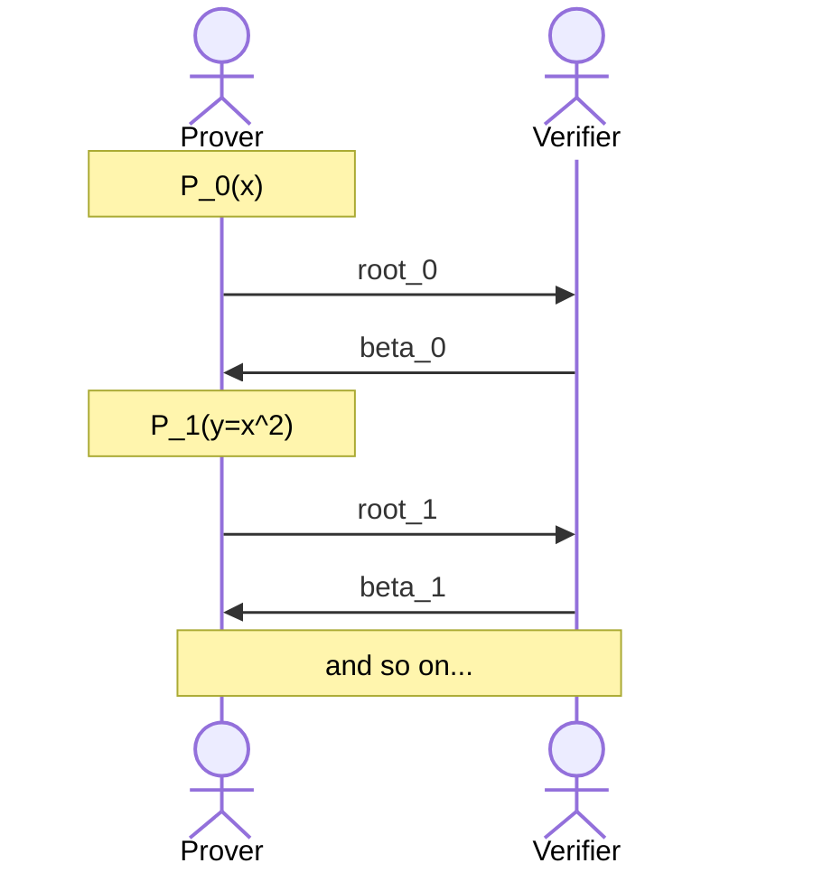
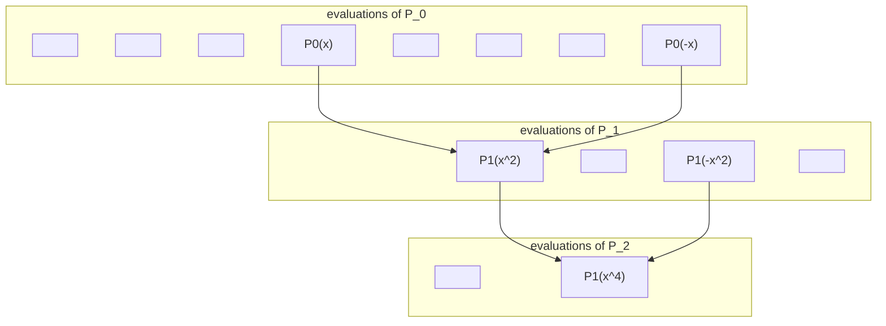

> # Week 4
>
> We talked about FRI, STARK.

# FRI

**Fast Reed-Solomon Interactive Oracle Proof of Proximity** (FRI) is a commitment scheme that is based on hash functions and proximity tests. You show that a given functions is "close" to a low-degree polynomial.

### **Recall**: SNARKs

First, lets recall that a SNARK is made up of two components:

- **Interactive Oracle Proof (IOP)**: A protocol that allows a prover to convince a verifier that a statement is true. The prover sends a series of messages to the verifier, and the verifier responds with challenges. The prover must respond to these challenges in a way that convinces the verifier that the statement is true.

- **Commitment Scheme**: A commitment is a cryptographic primitive that allows a prover to commit to a value without revealing it. The prover can later reveal the value and prove that it was the same value that was committed to.

Most often, we use IOPs and commitment schemes built for polynomials, to which we refer to as polynomial IOPs (poly-IOP) and polynomial commitment schemes (PCS). PCS is more often the performance bounding part, and can significantly affect the **proving time** and **proof size**. A PCS should be **binding** and **hiding**; and it has three algorithms (1) setup, (2) commitment, (3) evaluation.

### **Recall**: KZG

Last week we have covered **KZG** commitments:

- used pairings over Elliptic Curves
- requires trusted setup
- computes commitment with multi-scalar multiplication (MSM) where the result is just points on the curve.
- evaluation proofs are short: just a commitment to the quotient polynomial & independent of the size of polynomial

MSM is the most expensive part here.

### **Recall**: Reed-Solomon

We had covered Reed-Solomon Codes before, but here is a quick recap: a message $m = (a_0, a_1, \ldots, a_k)$ is treated as a polynomial and the codeword is composed of its evaluations on $n$ points where $n>k$.

$$
(a_0, a_1, \ldots, a_k) \to (b_0, b_1, \ldots, b_k, \ldots, b_n)
$$

The distance between two codewords is the number of points where they differ. The Reed-Solomon code has distance $d = n-k+1$.

## Commit Phase

In FRI, we will first choose a domain:

$$
D_0 := \{h\omega^k : k \in \mathbb{Z}_n\}
$$

Here, $\omega$ is a primitive $n$-th root of unity, and $h$ is called the _offset_. The offset is for convenience, and it is not necessary to have it.

Using this domain, we will compute $P(x_k)$ for $x_k \in D_0$ which is essentially producing the Reed-Solomon encoding of $P$. This gives us $n$ evaluations $P(h), P(h\omega), \ldots, P(h\omega^{n-1})$. We can use FFT for this, since the domain is built over roots of unity. In FRI, this evaluation part is the most computationally expensive part.

Using these $n$ evaluations, we will create a **Merkle Tree** and compute the **Merkle Root**. This root is the **commitment**. Computing the tree & root given a polynomial and its domain is the **Low-Degree Extension** (LDE).

Notice that the verifier can query an evaluation from $D_0$, all the prover has to do is provide the Merkle Path so that verifier can compute the root.

Now how do we know that the committed values are the evaluations of a polynomial, and not some other garbage? We will use a **proximity test** for this. However, proximity tests over a large domain can be expensive. So, we will use a **low-degree test** instead.

Again, consider the polynomial $P$ with its $n$ evaluations over the domain $D_0$, its Merkle Tree $\text{Tree}_0$ and Merkle Root $\text{root}_0$ as defined above. Let $P = P_0$, as our starting polynomial. We will now compute smaller polynomials by splitting the polynomials into even and odd parts, just like radix-2 FFT.

$$
P_0(x) = P_{0e}(x^2) + xP_{0o}(x^2)
$$

If $P_0$ has $n$ coefficients, then $P_{0e}$ and $P_{0o}$ will have $n/2$ coefficients each. Now, we _ask the verifier_ for some random coefficients $\beta_0$, and compute our next polynomial $P_1$ as:

$$
P_1(y = x^2) = P_{0e}(y) + \beta_0 P_{0o}(y)
$$

Now, we compute the domain for this polynomial $D_1 = \{x_k^2 : x_k \in D_0\}$ and its evaluations $P_1(x_k^2)$. Remember that if $\omega$ is a primitive $n$-th root of unity, then $\omega^2$ is a primitive $n/2$-th root of unity.

Finally, we will compute the evaluations of $P_1$ over $D_1$ and we will create a Merkle Tree $\text{Tree}_1$ and compute the Merkle Root $\text{root}_1$. We can continue reducing the degree of polynomial just like before:

$$
P_1(y) = P_{1e}(y^2) + yP_{1o}(y^2)
$$

Verifier gives us $\beta_1$ and we compute $P_2$:

$$
P_2(z = y^2) = P_{1e}(z) + \beta_1 P_{1o}(z)
$$

As we can see, this is a recursive process and we continue this until at $\log{n}$ steps we end up with a constant polynomial (i.e. has degree 0), along with a series of Merkle Trees and Merkle Roots.

This process of splitting the polynomial in two, asking for a random coefficient, and computing a half-degree polynomial from that is called **random-folding**.

### Fiat-Shamir Transform

Instead of asking the verifier for randomness, we can use **Fiat-Shamir transform** to generate the randomness without any interactions with the verifier. To do this, a transcript of all prover steps is kept within the protocol, and a hash of this transcript is used to generate the randomness, under the random-oracle model.

You can see this within the code as well, see: <https://github.com/lambdaclass/lambdaworks/blob/main/provers/stark/src/transcript.rs>.

### Blow-up Factor

The number of coefficients in our polynomial is $n$, but our domain $D$ can be of larger size. The ratio $D/n$ is called the blow-up factor.

If you have a larger blow-up factor, you can make less queries for the same amount of security. This means that the proof size is smaller. However, the computations will be more expensive the the memory usage will be higher, due to storing Merkle Trees.

## Query Phase

In the query phase, the verifier will ask for evaluations of the polynomial at some random points. The prover will provide the evaluations and the Merkle Paths to the verifier. The verifier can then compute the Merkle Roots and verify that the evaluations are correct.

Recall that $P_i(x^2)$ is written as a linear combination of $P_{{i-1}o}(x^2)$ and $P_{{i-1}e}(x^2)$. With a quick observation, we can see that both the even and odd polynomials can be represented as an evaluation of the original polynomial:

$$
\begin{align*}
P_{0e}(x^2) &= \frac{P_0(x) + P_0(-x)}{2} \\
P_{0o}(x^2) &= \frac{P_0(x) - P_0(-x)}{2x}
\end{align*}
$$

So, we can imagine how an evaluation "folds" with a pictoral example such as below:

As shown above, we have 2 evaluations for each step. In the end, the resulting evaluation is that of the constant polynomial. In $\log{n}$ steps, we have reduced the polynomial to a constant value which is the **commitment** itself, meaning that the polynomial is close to a low-degree polynomial. Otherwise, we wouldn't be able to reduce it to a constant polynomial is that many steps.

For each evaluation, the prover provides an authentication path (the path of the respective Merkle Tree for that evaluation) which has $\log{n}$ elements. The total size is therefore $\log^2{n}$.

Now that we have made sure of the degree of polynomial, we must also make sure that it evaluates to some value at a point that verifier picked, i.e. $P(z) = v$. We can do this by using an idea similar to what we have done in KZG. If $P(z) = v$, then $P(z) - v = 0$ and $P(x) - v$ is divisble by $(x-z)$. We can use this to compute the quotient polynomial $Q(x)$:

$$
\frac{P(x) - v}{x - z} = Q(x)
$$

Now, all we have to do is apply FRI to this quotient polynomial instead, and we can be sure that the polynomial is close to a low-degree polynomial & it evaluates to $v$ at $z$.

## Batch Proofs

If you have a series of polynomials $p_0, p_1, \ldots, p_k$ and some random coefficients $a_0, a_1, \ldots, a_k$ you can use FRI to commit to all of them by committing to their linear combination instead:

$$
P(x) = \sum_{i=0}^k a_i p_i(x)
$$

# STARK

In STARKs, instead of using Square Span programs that was based on $(U\cdot z)^2 = 1$, we will using a different type of representation called **Algebraic Intermediate Representation** (AIR). There are two components of AIR:

- Execution Trace
- Set of Polynomial Constraints

An execution trace is to be thought of like a table with some columns, where every column denotes a register (as in CPU register) and a column denotes the "clock". In this table, to ensure correctness you have to:

- Check that **initial** values are correct
- Check that jumps between each step (i.e. **transitions**) are correct
- Check that **final** values are correct
- Variables are consistent / well-formed, i.e. some register is boolean or such

There are several types of constraints:

- Boundary constraints
- Consistency constraints
- Transition constraints

These constraints will have steps where they apply, along with the registers that they apply to.

- $r_1(t=0)=5$ means that register 1 at time 0 should be 5
- $r_3(t)(1 - r_3(t)) = 0$ means that register 3 is a boolean (bit) for all steps

Transition steps are given as a multivariate polynomial $P(x, y)$ where $x$ is current step and $y$ is next step. For example, if register 2 is to be squared every step, this can be captured as $P(x, y) = y - x^2$ which makes all correct steps a root of this polynomial.

## Simple Example

Consider the table with columns $t, x$ with constraints:

- $x_0 = 2$
- $x_{i+1} = x_i^2$

You are given the execution trace (i.e. witness):

| $t$      | $x$       |
| -------- | --------- |
| 0        | 2         |
| 1        | 4         |
| 2        | 16        |
| $\ldots$ | $\ldots$  |
| $n$      | $2^{2^n}$ |

Our set of polynomial constraints are:

- Initial: $x(t = 0) = 2$
- Transitions: $x_{i+1} = x_i^2$ captured by $P(x, y) = y - x^2$
- Final: $x(t=n) = 2^{2^n}$

## STARK Protocol: Prover

We will now describe the non-interactive protocol (i.e. using Fiat-Shamir transform):

1. Start with a transcript containing all the public inputs

2. Suppose the number of steps ($n+1$ in this case) is a power of two; even if its not you can add dummy rows to ensure this. Choose an **interpolation domain** $D_i = \{g^0, g^1, \ldots, g^n\}$ where $g$ is a primitive $n$-th root of unity that generates the group of order power of two. Then, view $x_i$ as the evaluations of $t(x)$ over $D_i$, as in $t(g^i) = x_i$. Interpolate this polynomial (using FFT) to find $t(x)$ which represents the trace.

3. Commit to the trace polynomial $t(x)$. Choose a **low-degree extension domain** $D_0$ (such that $|D_0| > |D_i|$ and $|D_0| = 2^b|D_i|$).

> Here, $D_0 = \{h\omega, h\omega^1, h\omega^2, \ldots\}$ where $h$ is offset and $\omega$ is a primitive root of unity. Note that $h$ is not in this set by itself.

4. Append the Merkle root of $t$ to the transcript. Once the root is appended, we are committed to this transcript. Now, we are ready to ask the Verifier for some random challenge.

5. Compose the polynomial $t(x)$ with the constraints. Notice that by multiplying $x$ with $g$ in the polynomial, you can reach to later steps, i.e. $t(gx)$ goes to the evaluation of $x$ at one step forward.

$$
P(t(x), t(gx)) = t(gx) - t(x)^2 = C(x)
$$

6. Sample random values (i.e. hash your transcript to obtain randomness) to create a linear combination of polynomials (i.e. Batch FRI).

$$
CP(x) = \alpha\frac{C_t(x)}{Z(x)} + \beta \frac{t(x)-2}{x-1} + \delta \frac{t(x) - 2^{2^n}}{x - g^n}
$$

> Here, $Z(x)$ is the vanishing polynomial over domain $D_i$ except the final element.
>
> $$
> Z(x) = \prod_{i=0}^{n-1} (x - g^i) = \prod_{i=0}^{n} (x - g^i)(x - g^n)^{-1} = \frac{x^{n+1} - 1}{x - g^n}
> $$
>
> The last reduction to obtain $x^{n+1} - 1$ from the product itself is due to the fact that $g^n$ is a primitive root of unity.

7. Commit to $CP(x)$ using $D_0$, where you do a low-degree extension to obtain a Merkle root.

8. Append this root to transcript.

9. Sample an out-of-domain point $z$ that is neither within $D_i$ nor $D_0$.

10. Compute $CP(z)$, $t(z)$ and $t(gz)$; this is also known as "Mask". Here, the verifier will check that indeed $CP(z)$ can be obtained from $t(z)$ and $t(gz)$ as shown in step 6 above. Using an out-of-domain sample here makes things more secure, and makes things harder for a malicious prover.

> You can ignore this step (along with step 9) if you want, but you will have to do more consistency checks otherwise.

11. Append $CP(z)$, $t(z)$ and $t(gz)$ to the transcript.

12. Sample random $\delta, \epsilon, \zeta$ for the next step.

13. Compute $P_0$ which we call **DEEP ALI** (Algebraic Linking Identity). This is done to ensure that evaluations related to point $z$ belong to the actual polynomials $CP$ and $t$.

$$
P_0(x) = \delta \frac{CP(x) - CP(z)}{x-z} + \epsilon \frac{t(x) - t(z)}{x-z} + \zeta \frac{t(x) - t(gz)}{x-gz}
$$

14. Apply FRI to $P_0(x)$ (i.e. Commitment and Query phases of FRI).

The resulting proof has some evaluations alongs with the authentication paths (Merkle Tree path) and roots, and the out-of-domain evaluations.

> You will have one polynomial for each column in the table. In our example above we have only one column for $x$.

## STARK Protocol: Verifier

The verifier is a bit more simpler than the prover, still plenty of work though.

1. **Replay all the challenges**. Start with the transcript of public inputs, append root of $t(x)$, sample $\alpha, \beta, \delta$, append root of $CP(x)$, sample $z$, append $CP(z), t(z)$ and $t(gz)$, sample $\delta, \epsilon, \zeta$ and resample all FRI randomness & queries.

2. Check that $CP(z)$ is correctly linked with $t(z), t(gz)$. To do this, first compute $C_t(z)$ and then find the linear combination using $\alpha, \beta, \delta$ and see if it equals $CP(z)$ as given by the prover:

$$
\frac{C_t(z)}{Z(z)} = \frac{t(gz) - t(z)^2}{Z(z)}
$$

$$
CP(z) \iff \alpha\frac{C_t(z)}{Z(z)} + \beta \frac{t(z)-2}{z-1} + \delta \frac{t(z) - 2^{2^n}}{z - g^n}
$$

3. **Check FRI**. This means checking all the authentication paths and the folding steps, as well as checking the correctness of the DEEP ALI polynomial. For the latter, simply do:

$$
\delta \frac{CP(x) - CP(z)}{x-z} + \epsilon \frac{t(x) - t(z)}{x-z} + \zeta \frac{t(x) - t(gz)}{x-gz}
$$

If all these checks pass, the proof is correct.

## Implementation

Of course, LambdaWorks has an implementation: <https://github.com/lambdaclass/lambdaworks/tree/main/provers/stark>.

> They also have a "grinding" implementation, which is a proof-of-work that makes proving a bit more costly for more security.

## See Also

- [ETHStark](https://eprint.iacr.org/2021/582.pdf)
- <https://aszepieniec.github.io/stark-anatomy/fri.html>
- <https://dev.risczero.com/proof-system/stark-by-hand>
- <https://starkware.co/stark-101/>
