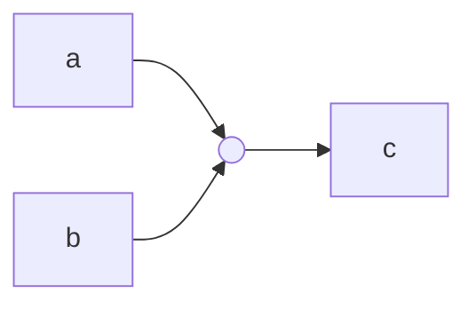
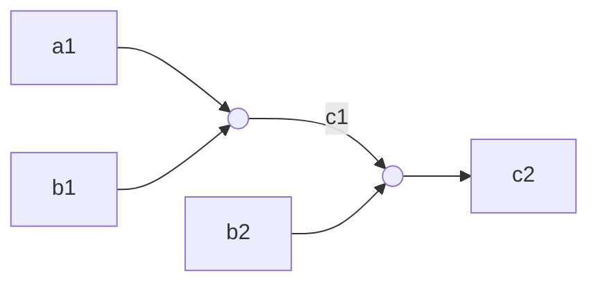

> # Week 5
>
> We talked about PLONK.

# Plonk

Plonk is a zk-SNARK that is based on the polynomial commitment scheme. It is a universal and scalable zk-SNARK that can be used for any NP language. It is a proof system that allows a prover to convince a verifier that a statement is true without revealing any information about the statement itself. With Plonk, you make use of **arithmetization** and a **polynomial commitment scheme**. For PCS you have several options:

| PCS | Used in                    | Notes                                                    |
| --- | -------------------------- | -------------------------------------------------------- |
| KZG | "Vanilla" Plonk            | Trusted Setup, small proof size                          |
| IPA | Halo2 / Kimchi             | Efficient recursion                                      |
| FRI | Boojum / Plonky2 / Plonky3 | No trusted setup, large proof size, can use small fields |

IPA stands for Inner-product Argument, and we can think of it as some kind of Pedersen commitment.

In FRI, the ability to use small fields enable us to implement faster provers, which is nice.

> **Proof Recursion / Aggregation**: We should make a small note on this, now that we mention "Efficient recursion" in IPA. The idea here is that you can create a proof that you have verified a proof. In particular, you can use a different proof system to do this, i.e. use a Groth16 to prove that you have a valid STARK proof; and verify this final proof on Ethereum. This also allows for proof aggregation, where you can aggregate multiple proofs into a single proof.

## **Recall**: R1CS

Before Plonk, the most widely used system was R1CS where we work with the equation:

$$
(Az) \cdot (Bz) = Cz
$$

Here, $A, B, C$ are sparse matrices, they contain a lot of zeros.

## Plonk Gates

Imagine that you have a gate with 2 inputs $a, b$ and an output $c$, such as:

Consider the table $T$:

| $a$      | $b$      | $c$      |
| -------- | -------- | -------- |
| $a_1$    | $b_1$    | $c_1$    |
| $a_2$    | $b_2$    | $c_2$    |
| $\ldots$ | $\ldots$ | $\ldots$ |
| $a_n$    | $b_n$    | $c_n$    |

Now, consider some selectors $q_i$ and define the equation:

$$
q_{L_i}a_i + q_{R_i}b_i + q_{M_i}a_ib_i + q_{O_i}c_i + q_{C_i} = 0
$$

This equation above is a "Basic Gate", and it allows you to capture certain computations.
If $q_L=1,, q_R=1$ and $q_O =-1$ and all other selectors are 0, then you get an addition gate:

$$
a + b - c = 0
$$

If $q_M=1$ and $q_O =-1$ and all other selectors are 0, then you get a multiplication gate:

$$
ab - c = 0
$$

With more clever selectors, you can implement **custom gates**. For example, you can introduce a term with selector like $q_Na^5$ so that when $q_N=1$ and $q_O=-1$ you get the constraint:

$$
a^5 - c = 0
$$

This can help with some hard computations like elliptic curve additions, posedion hashes and foreign-field arithmetic. Moreover, custom gates allow one to use **lookup gates**. With a lookup gate, you can optimize a computation that is hard to arithmetize (e.g. SHA2 or AES) by simply storing a table of its inputs and outputs and then use that table to lookup a correct result.

## To Polynomials

Consider the basic gate again:

$$
q_{L_i}a_i + q_{R_i}b_i + q_{M_i}a_ib_i + q_{O_i}c_i + q_{C_i} = 0
$$

for $i = 0, 1, \ldots, n-1$. Now, we will encode these equations as relationships between polynomials. We will define polynomials $a(x), b(x), c(x)$ and for selectors $q_L(x), q_R(x), q_M(x), q_O(x), q_C(x)$.

Similar to STARK from the week before, we will pick a domain of size $n$ such as $D_i = \{g^0, g^1, \ldots, g^{n-1}\}$. We will interpolate the polynomials so that:

- $a(g^i) = a_i$
- $b(g^i) = b_i$
- $c(g^i) = c_i$

> We don't need to interpolate the selector polynomials because they are circuit-dependent, you can find them once you wrote the circuit independent of the inputs; they are "execution independent".

Now, define the polynomial $P(x)$ that is:

$$
P(x) = q_L(x)a(x) + q_R(x)b(x) + q_M(x)a(x)b(x) + q_O(x)c(x) + q_C(x)
$$

If the constraints are valid, then it must be that $P(x) = 0$ for all $x \in D_i$. This would therefore mean that $P(x)$ is some vanishing polynomial $Z(x)$ times a quotient polynomial $Q(x)$ that is:

$$
P(x) = Z(x)Q(x)
$$

> Recall that vanishing polynomial is the product of roots over the domain, and when using roots of unity has a really nice form, shown below:
>
> $$
> Z(x) = \prod_{x_i \in D_i} (x - x_i) = x^n - 1
> $$

## Public Inputs

For public inputs, we can add "dummy" gates where the input is $a_i$ and only $q_{L, i}=1$ and all other selectors are 0. The constraint is that $a_i = p_i$ where $p_i$ is the public input.

Again we are working over the basic gate equation, but the resulting polynomial is the public inputs polynomial:

$$
PI(x) = q_L(x)a(x) + q_R(x)b(x) + q_M(x)a(x)b(x) + q_O(x)c(x) + q_C(x)
$$

For the dummy gates this results in the constraint:

$$
a(g^i) = p_i = PI(g^i)
$$

The public input polynomial beyond the dummy gates should be equal to 0, i.e. $PI(g^i) = 0$. By splitting the gates like this, and using the selectors, we can take the public input polynomial $PI(x)$ out of circuit polynomial $P(x)$ itself.

Note that the prover and verifier can compute this polynomial on their own sides, and they can use Lagrange basis polynomials for this:

$$
PI(x) = \sum_{i=0}^{n-1} p_i \cdot L_i(x)
$$

where $L_i(x)$ is the Lagrange basis polynomial such that $L_i(x_i) = 1$ and $L_i(x_j) = 0$ for $j \neq i$.

## Connecting Gates

The gate equations above capture the constraint within a gate alone, but not their connections!

In the diagram above for example, $c_1$ of the first gate must be equal to $a_2$ of the second gate. Plonk has a notion of **copy constraints** to tackle this problem of "wiring" the gates correctly.

> The idea here is similar to "Memory Check" in CairoVM.

### Permutation Argument

Fix some value $i$, and consider two polynomials $Z(x)$ and $Z^*(x)$. The claim is that $L_i(a)(Z(a) - Z^*(a)) = 0$ for all $a \in D_i$ if and only if $Z(g^i) = Z^*(g^i)$.

Consider $f, g$ of degree less than $d$. Consider a permutation $\sigma : [n] \to [n]$ such that $g = \sigma(f)$ if for every $i \in [n]$ we have $g(g^i) = f(g^{\sigma(i)})$.

For example, the permutation $\sigma := \{1, 2, 3, 4\} \to \{3, 4, 2, 1\}$ implies the equalities:

- $g(\omega^1) = f(\omega^3)$
- $g(\omega^2) = f(\omega^4)$
- $g(\omega^3) = f(\omega^2)$
- $g(\omega^4) = f(\omega^1)$

Verifier samples $\beta, \delta \in \mathbb{F}$ and sends them to prover. Then,

$$
f'(\omega^i) = f(\omega^i) + \beta \cdot i + \delta
$$

$$
g'(\omega^i) = g(\omega^i) + \beta \cdot \sigma(i) + \delta
$$

Then, the polynomial $Z(x)$ is computed as:

$$
Z(w) = 1 : \forall i = 2 \ldots n
$$

$$
Z(\omega^i) = \prod_{1 \leq j < i} \frac{f'(\omega^j)}{g'(\omega^j)} = Z(\omega^{i-1})\frac{f'(\omega^{i-1})}{g'(\omega^{i-1})}
$$

With this, the verifier can check for every $a \in \{\omega^0, \omega^1, \omega^2, \ldots\}$ that:

1. $L_1(a)(Z(a) - 1) = 0$
2. $Z(a)f'(a) = Z(\omega a)g'(a)$

> The permutation trick here is better found in the Plonk paper.
